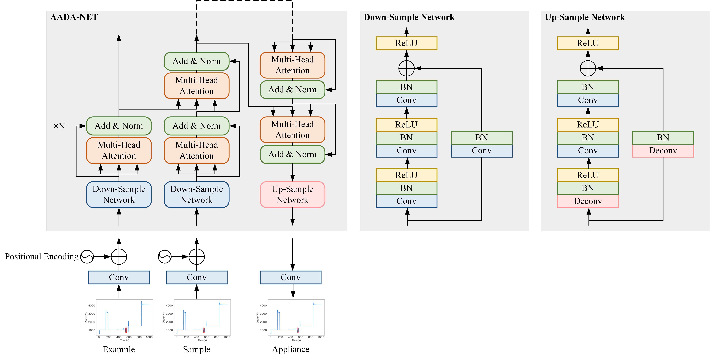

# AADA-设备自适应分解算法

本项目旨在构建一种设备自适应负荷分解算法，以提高非侵入负荷监测（NILM）的迁移能力，并解决新房屋、新设备监测性能差的问题。



## 快速开始

### 训练模型

```python
python train.py
```

### 测试模型

```python
python test.py
```

### 部署web服务器

```python
python app.py
```


## 技术架构

本项目基于python实现，采用torch+lightning搭建相关模型，采用fastapi实现web服务器。其中：

- train.py: 存放训练相关代码
- test.py: 存放测试相关代码
- model.py: 用于定义模型结构以及训练和测试的具体逻辑
- dataset.py: 用于搭建数据集
- select_examples.py: 用于采集各个电器的示例
- examples: 用于存放各个电器的示例
- config.yaml: 用于存储配置信息

相关数据来源：
- ukdale: https://data.ukedc.rl.ac.uk/browse/edc/efficiency/residential/EnergyConsumption/Domestic/UK-DALE-2017/UK-DALE-FULL-disaggregated/ukdale.zip

- refit: https://pureportal.strath.ac.uk/en/datasets/refit-electrical-load-measurements-cleaned


## 代码示例

提供一些关键功能的代码示例。

```python
python train.py --batch_size 64
```

> 问题：模型管理、模型特化、新设备必须重新训练设备模型

> 其实，也可以直接检索增强，不固定example，直接从知识库中搜索
